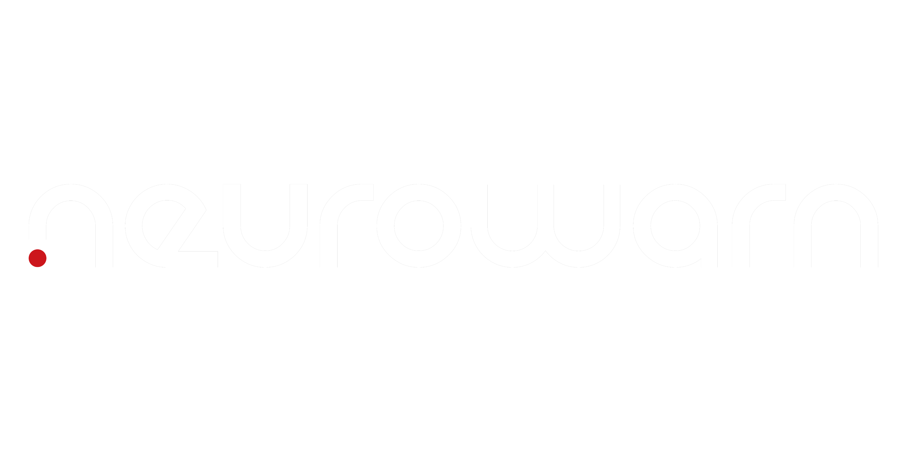

> **NeuroWarn BCI: Enhancing Safety in EEG-Controlled Wheelchairs with an RNN-Based Warning System**

## 📋 Overview

NeuroWarn BCI is a safety enhancement system for EEG-controlled wheelchairs that uses a Recurrent Neural Network (RNN) to predict potential hazards and provide warnings to users. The system integrates brain-computer interface technology with obstacle detection sensors to create a safer mobility experience for users with severe motor disabilities.

## 👥 Development Team

- **Alecxander Jamille Andaya** 
- **Kyle E. Billones** 
- **Matthew Ariel A. Enarle**
- **Jasper M. Nillos** 
- **Shayne B. Yanson**

*College of Information and Communications Technology*  
*West Visayas State University*  
*La Paz, Iloilo City, Philippines*

## 📂 Repository Structure

- 🖥️ [/src](./src) - Source code for the entire system
  - 🔌 [/src/backend](./src/backend) - Python code for BCI and hardware control
  - 🌐 [/src/frontend](./src/frontend) - Web dashboard interface
  - 🛠️ [/src/hardware](./src/hardware) - Arduino code and hardware configurations
- 📝 [/docs](./docs) - Documentation and user guides
- 🔧 [/hardware](./hardware) - Hardware schematics and configurations
- 🤖 [/models](./src/models) - Trained RNN models

## 🚀 Getting Started

### Quick Setup

1. **Clone this repository**
   ```bash
   git clone https://github.com/yourusername/neurowarn.git
   cd neurowarn
   ```

2. **Follow component-specific guides:**
   - 🔌 [Backend Setup](./src/backend/README.MD)
   - 🌐 [Frontend Setup](./src/frontend/README.MD)
   - 🛠️ [Hardware Setup](./src/hardware/README.MD)

3. **See the [main source README](./src/README.MD) for system overview**

## 📚 Documentation

- 📋 [User Manual](./docs/NeurowarnUserManual.pdf) - Complete usage guide
- 📄 [Thesis Manuscript](./docs/NeurowarnBCI.pdf) - Academic paper

## 🙏 Acknowledgements

Special thanks to **Mark Solidarios** for his guidance and mentorship throughout the development of this project. We would also like to thank the faculty of the College of Information and Communications Technology at West Visayas State University for their support and valuable feedback.

## ⚖️ License & Copyright

 2025 All Rights Reserved

This project is the intellectual property of the authors and the College of Information and Communications Technology, West Visayas State University. See the [DISCLAIMER.md](./DISCLAIMER.md) file for details.

*This project is intended for academic and research purposes only.*
